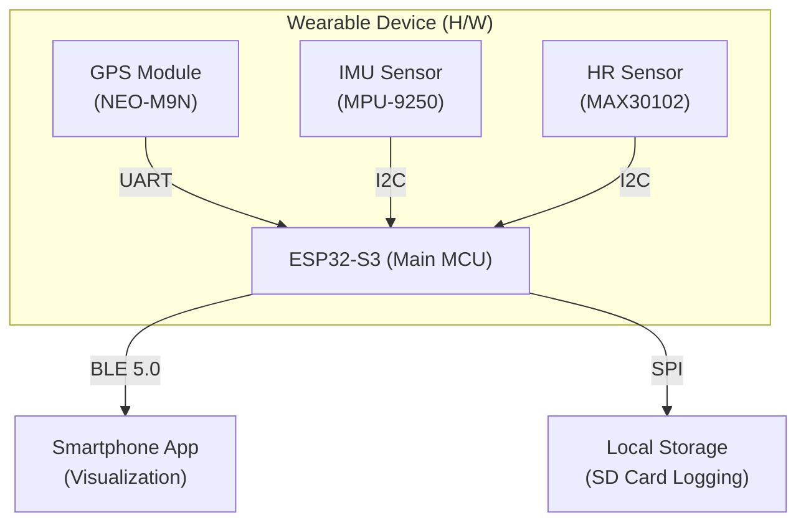

# 🏃‍♂️ GPS & Kalman Filter Based Healthcare Gamification Platform

> **Real-time Sensor Fusion & Territory Capture Project**
> 
> 기성품 API 연동을 넘어, 하드웨어 레벨의 센서 데이터 수집부터 칼만 필터(Kalman Filter)를 활용한 위치 보정, 그리고 게이미피케이션 엔진까지 직접 구현하는 헬스케어 프로젝트입니다.

---

## 📖 Project Overview

### 1. Introduction

단순한 운동 기록 앱이 아닙니다. 사용자가 **실제 지리적 영역(Polygon)**을 운동을 통해 감싸서 "정복"하는 **땅따먹기 형식의 게이미피케이션 플랫폼**입니다. 

GPS의 오차를 보정하기 위해 **ESP32-S3** 기반의 자체 제작 웨어러블 디바이스에서 **9축 IMU**와 **GPS** 데이터를 융합(Sensor Fusion)하며, **칼만 필터(Extended Kalman Filter)**를 적용해 정밀한 경로를 추적합니다.

### 2. Motivation & Engineering Goals

* **Deep Dive into Data:** 단순히 OS가 제공하는 가공된 위치 API를 사용하는 것이 아니라, `NMEA` Raw 데이터와 가속도/자이로 센서의 Raw 데이터를 직접 핸들링합니다.
* **Sensor Fusion Implementation:** 불확실한 센서 데이터(Noise)를 수학적 모델(Bayesian Filter)로 추정하고 보정하는 엔지니어링 역량을 입증합니다.
* **Full-Cycle Development:** 임베디드 하드웨어 제작(Firmware) → 데이터 파이프라인(Data Engineering) → 사용자 앱(Application)에 이르는 전체 주기를 1인 개발로 수행합니다.

---

## 🏗 System Architecture

시스템의 데이터 흐름과 하드웨어 연결 구성입니다.

**MCU 내부 처리 과정:**
1. Sensor Data Acquisition (Sync)
2. Pre-processing (Noise Filtering)
3. Extended Kalman Filter (Pos/Vel/Heading Est.)
4. Gamification Logic (Zone Calc)

---

## 🛠 Hardware Specifications (BOM)

정확한 데이터 수집과 연산을 위해 선정된 핵심 부품 사양입니다.

| **Component** | **Model** | **Spec & Features** | **Interface** |
|---------------|-----------|---------------------|---------------|
| **MCU** | **ESP32-S3** | Dual Core 240MHz, WiFi/BLE 5.0, FreeRTOS 지원 | - |
| **GPS** | **Ublox NEO-M9N** | GNSS Multi-band, 1.5m CEP 정확도, 25mW 저전력 | UART |
| **IMU** | **MPU-9250** | 9-Axis (Accel+Gyro+Mag), 200Hz High Sampling | I2C (Add: 0x68) |
| **Heart Rate** | **MAX30102** | PPG 방식 (Optical), SpO2 측정 가능 | I2C |
| **Battery** | **LiPo** | 500mAh, 3.7V (with Protection Circuit) | - |

---

## 📐 Core Algorithm: Kalman Filter & Bayesian Estimation

GPS 데이터의 튀는 현상(Drift)을 방지하고 정확한 경로 "영역 감싸기" 판정을 위해 베이지안 필터 이론을 적용했습니다.

### 1. State Vector Definition

시스템의 상태 **$x$** 는 위치(**$p$**), 속도(**$v$**), 방향(**$\theta$**)으로 정의합니다.

$$
x = [p_{x}, p_{y}, v_{x}, v_{y}, \theta]^{T}
$$

### 2. Recursive Bayesian Estimation (Conceptual)

현재 상태 **$x_t$** 는 이전 상태 $x_{t-1}$와 제어 입력 **$u_t$**, 그리고 관측값 **$z_t$**에 의해 확률적으로 추정됩니다.

* **Prediction (예측):**

$$
\hat{x}_{k|k-1} = f(\hat{x}_{k-1}, u_{k})
$$

* **Correction (보정):**

$$
\hat{x}_{k} = \hat{x}_{k|k-1} + K_{k}(z_{k} - H\hat{x}_{k|k-1})
$$

### 3. Gamification Logic (Dynamic Scoring)

심박수(Heart Rate) 데이터를 기반으로 운동 강도에 따른 가중치를 부여하여 단순 이동이 아닌 "운동"을 유도합니다.

* **Zone 1-2 (Walking):** Base Score **× 1.0**
* **Zone 3-4 (Jogging/Running):** Score **× 1.5 ~ 2.0**
* **Algorithm:** Point-in-Polygon + Path Coverage Calculation

---

## 💾 Data Engineering & Pipeline

센서에서 발생하는 고빈도 시계열 데이터를 처리하기 위한 데이터 파이프라인 설계안(Kafka Topic)입니다.

| **Topic Name** | **Partition Key** | **Payload** | **Throughput** | **Retention** |
|----------------|-------------------|-------------|----------------|---------------|
| `raw.gps.events` | `user_id` | Lat, Lon, Accuracy, Timestamp | ~1 msg/sec | 7 Days |
| `raw.hr.events` | `user_id` | BPM, RR Interval, Timestamp | ~1 msg/sec | 7 Days |
| `raw.imu.events` | `user_id` | Acc[3], Gyro[3], Mag[3] | **~50 msg/sec** | 3 Days |

> [!NOTE]
> IMU 데이터는 샘플링 레이트가 높으므로(50~200Hz), 엣지(Device) 단에서 1차 필터링 후 전송하거나 보존 기간을 짧게 가져가는 전략을 사용합니다.

---

## 🚀 Project Roadmap

### Phase 1: Hardware & Basic Sensing (Current Status)

- [x] ESP32-S3 + Sensors (GPS, IMU, HR) Wiring 및 납땜
- [x] I2C/UART 통신 드라이버 구현
- [x] Raw Data 수집 및 SD 카드 로깅 구현
- [x] Basic Kalman Filter 적용 (Python Simulation)

### Phase 2: Connectivity & Application

- [ ] BLE 5.0 GATT Profile 구현 (Device <-> App)
- [ ] iOS/Android App 지도 연동 (Mapbox or Google Maps)
- [ ] 실시간 "영역 감싸기" 시각화 구현

### Phase 3: Backend & Data Analysis

- [ ] Kafka & Time-series DB 구축
- [ ] 심박변이도(HRV) 분석 및 정밀 칼로리 알고리즘 고도화
- [ ] 사용자간 경쟁(Leaderboard) 시스템 도입

---

## 👨‍💻 Author

**김호중 (Kim Ho-jung)**  
Yonsei University Mirae Campus

*Searching for a role where I can build things from scratch.*
